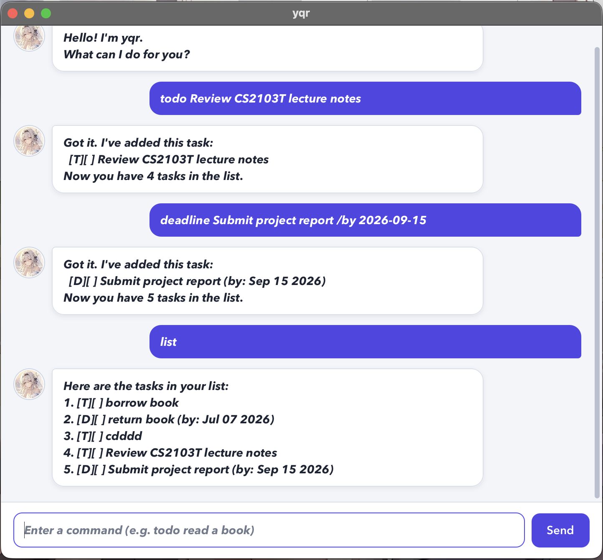

# yqr User Guide

**yqr** is a desktop task manager that helps you record todos, deadlines, and
events through short text commands. It saves your tasks automatically, so they
are available the next time you start the app.



## Quick start

1. Ensure that Java 25 is installed.
2. Open a terminal in the project folder.
3. Run `./gradlew run` on macOS or Linux, or `gradlew.bat run` on Windows.
4. Type a command in the text box and press <kbd>Enter</kbd> or select **Send**.

Commands are case-sensitive and should be entered in lowercase. Extra spaces
before, after, or between command arguments are accepted. Words written in
`UPPER_CASE` in this guide are values that you should replace.

## Command summary

| Action | Command format | Example |
| --- | --- | --- |
| Add a todo | `todo DESCRIPTION` | `todo Review lecture notes` |
| Add a deadline | `deadline DESCRIPTION /by DATE` | `deadline Submit report /by 2026-09-15` |
| Add an event | `event DESCRIPTION /from START /to END` | `event Project meeting /from 14:00 /to 15:00` |
| List tasks | `list` | `list` |
| Mark a task | `mark TASK_NUMBER` | `mark 1` |
| Unmark a task | `unmark TASK_NUMBER` | `unmark 1` |
| Delete a task | `delete TASK_NUMBER` | `delete 2` |
| Find tasks | `find KEYWORD` | `find report` |
| Undo the latest change | `undo` | `undo` |
| Exit | `bye` | `bye` |

## Adding a todo

Use a todo for a task without a fixed date or time.

Format: `todo DESCRIPTION`

Example:

```text
todo Review CS2103T lecture notes
```

yqr adds the todo to the end of the task list and displays the new task count.
It rejects an empty description or another task with identical details.

## Adding a deadline

Use a deadline for a task that must be completed by a particular date. Dates
must use the `yyyy-MM-dd` format.

Format: `deadline DESCRIPTION /by DATE`

Example:

```text
deadline Submit project report /by 2026-09-15
```

yqr validates the date, so impossible dates such as `2026-02-30` are rejected.
Specify `/by` exactly once.

## Adding an event

Use an event for an activity with a start and an end.

Format: `event DESCRIPTION /from START /to END`

Examples:

```text
event Team meeting /from 14:00 /to 15:00
event Workshop /from 2026-09-20 09:00 /to 2026-09-20 12:00
event Consultation /from Monday morning /to Monday afternoon
```

The start and end may both be times (`HH:mm`), dates (`yyyy-MM-dd`), date-times
(`yyyy-MM-dd HH:mm`), or descriptive text. When yqr can interpret both values
as times or dates, the start must be earlier than the end. Specify `/from` and
`/to` exactly once and in that order.

## Listing tasks

Display every task and its current number.

Format: `list`

```text
list
```

Task numbers can change after a task is deleted. Run `list` before using a task
number if you are unsure.

## Marking a task as done

Format: `mark TASK_NUMBER`

```text
mark 1
```

yqr changes the selected task's status from `[ ]` to `[X]`. The task number
must be a positive number currently shown by `list`.

## Marking a task as not done

Format: `unmark TASK_NUMBER`

```text
unmark 1
```

yqr changes the selected task's status back to `[ ]`.

## Deleting a task

Format: `delete TASK_NUMBER`

```text
delete 2
```

yqr permanently removes the selected task and displays the remaining task
count.

## Finding tasks

Search task descriptions for a keyword or phrase.

Format: `find KEYWORD`

```text
find report
```

yqr displays matching tasks in their original order. The search checks task
descriptions and does not search deadline dates or event times.

## Undoing the latest change

Undo the most recent command that added, deleted, marked, or unmarked a task.

Format: `undo`

```text
undo
```

The restored task list is saved immediately. Only the latest change can be
undone, and each change can be undone once. Commands that only display
information, such as `list` and `find`, do not replace the change available for
undo.

## Exiting yqr

Format: `bye`

```text
bye
```

The text box and **Send** button are disabled after the session ends. Restart
yqr to enter more commands.

## Data and error handling

yqr stores tasks in `data/yqr.txt` relative to the folder from which the app is
run. You do not need to create this file: if it is missing, yqr starts with an
empty task list and creates the file when a task is first saved.

If saved data cannot be read, yqr highlights the problem and starts with an
empty task list instead of closing unexpectedly. If a command contains a likely
typo, yqr suggests the closest command. Other invalid commands display the list
of available commands, while invalid dates, missing parameters, duplicate
parameters, and out-of-range task numbers receive specific error messages.

> **Tip:** Avoid editing `data/yqr.txt` manually. A malformed file cannot be
> loaded, and yqr will start that session with an empty task list.
